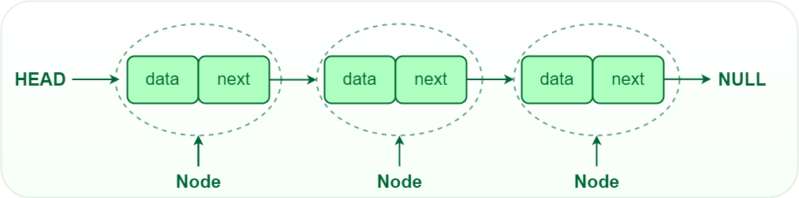

# Linked List

## What is a Linked List?
- A linked list is a linear data structure that includes a series of connected nodes. Here, each node stores the **data** and the **address** of the next node. For example,

- It is basically **chains of nodes**, each node contains information such as **data** and a **pointer to the next node** in the chain. In the linked list there is a **head pointer**, which points to the first element of the linked list, and if the list is empty then it simply points to null or nothing.

## Why linked list data structure needed?

Here are a few advantages of a linked list that is listed below, it will help you understand why it is necessary to know.

- **Dynamic Data structure:** The size of memory can be allocated or de-allocated at run time based on the operation insertion or deletion.
- **Ease of Insertion/Deletion:** The insertion and deletion of elements are simpler than arrays since no elements need to be shifted after insertion and deletion, Just the address needed to be updated.
- **Efficient Memory Utilization:** As we know Linked List is a dynamic data structure the size increases or decreases as per the requirement so this avoids the wastage of memory. 
- **Implementation:** Various advanced data structures can be implemented using a linked list like a stack, queue, graph, hash maps, etc.

## Different types of Linked List.
1. Singly Linked List

2. Doubly Linked List

3. Circular Linked List

