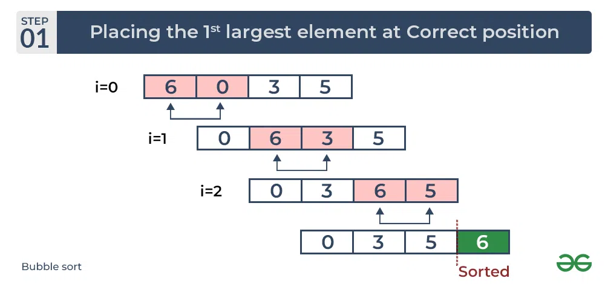
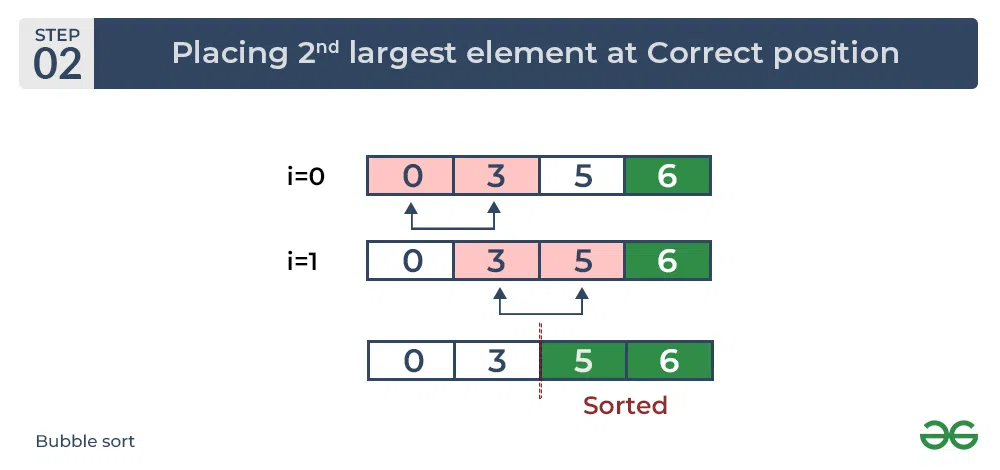
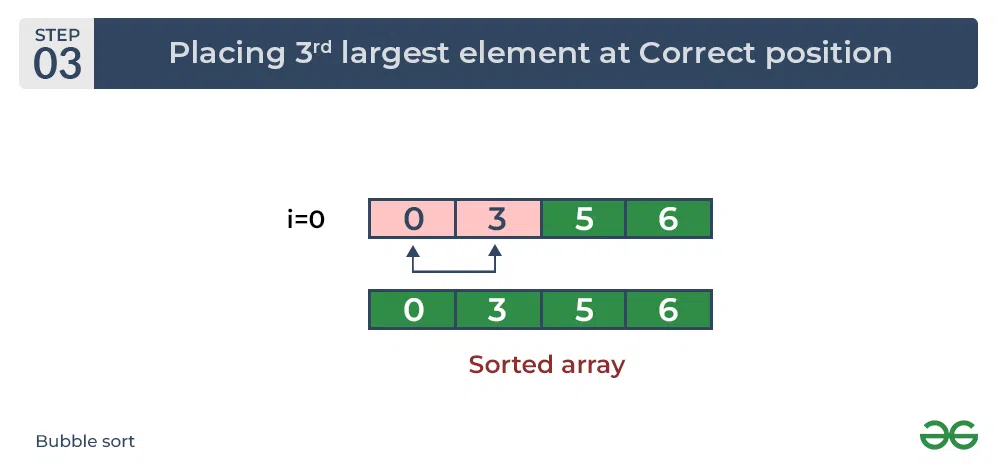

# Bubble Sort

## What is Bubble Sort?
**Bubble Sort** is the simplest [sorting algorithm](https://www.geeksforgeeks.org/sorting-algorithms/) that works by repeatedly swapping the adjacent elements if they are in the wrong order. This algorithm is not suitable for large data sets as its average and worst-case time complexity is quite high.1

## Working of Bubble Sort





## COMPLEXITY ANALYSIS
**Time Complexity:** O(N2)
**Auxiliary Space:** O(1)

## **Advantages of Bubble Sort:**

- Bubble sort is easy to understand and implement.
- It does not require any additional memory space.
- It is a stable sorting algorithm, meaning that elements with the same key value maintain their relative order in the sorted output.

## **Disadvantages of Bubble Sort:**

- Bubble sort has a time complexity of O(N2) which makes it very slow for large data sets.
- Bubble sort is a comparison-based sorting algorithm, which means that it requires a comparison operator to determine the relative order of elements in the input data set. It can limit the efficiency of the algorithm in certain cases.

## Code Example
```typescript
function bubsort(arr: number[]): void {
    for (let i = 0; i < arr.length; ++i) {
        for (let j = 0; j < arr.length - i - 1; ++j) {
            if (arr[j] > arr[j + 1]) {
                let temp = arr[j];
                arr[j] = arr[j + 1];
                arr[j + 1] = temp;
            }
        }
    }
}
```
