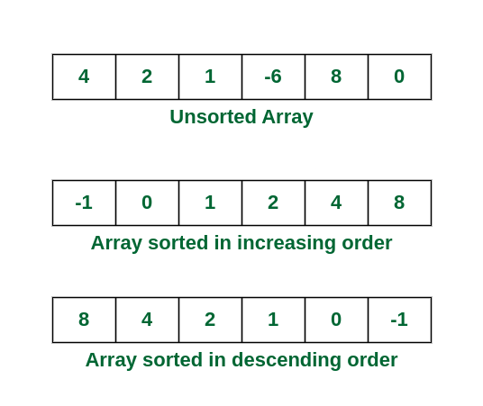

# Sorting

## What is Sorting?
In computer science, a sorting algorithm is an algorithm that puts elements of a list into an order. The most frequently used orders are numerical order and lexicographical order, and either ascending or descending. Efficient sorting is important for optimizing the efficiency of other algorithms (such as search and merge algorithms) that require input data to be in sorted lists. Sorting is also often useful for canonicalizing data and for producing human-readable output.

## Complexities Comparision
| Name            | Best Case | Average Case | Worst Case | Memory | Stable | Method Used      |
|-----------------|-----------|--------------|------------|--------|--------|------------------|
| Quick Sort      | n log n   | n log n      | n^2        | log n  | No     | Partitioning     |
| Merge Sort      | n log n   | n log n      | n log n    | n      | Yes    | Merging          |
| Heap Sort       | n log n   | n log n      | n log n    | 1      | No     | Selection        |
| Insertion Sort  | n         | n^2          | n^2        | 1      | Yes    | Insertion        |
| Tim Sort        | n         | n log n      | n log n    | n      | Yes    | Insertion & Merge|
| Selection Sort  | n^2       | n^2          | n^2        | 1      | No     | Selection        |
| Shell Sort      | n log n   | n^(4/3)      | n^(3/2)    | 1      | No     | Insertion        |
| Bubble Sort     | n         | n^2          | n^2        | 1      | Yes    | Exchanging       |
| Tree Sort       | n log n   | n log n      | n log n    | n      | Yes    | Insertion        |
| Cycle Sort      | n^2       | n^2          | n^2        | 1      | No     | Selection        |
| Strand Sort     | n         | n^2          | n^2        | 1      | No     | Selection        |

## Different Sorting Algorithms
- [BubbleSort](./BubbleSort.md)
- [QuickSort](./QuickSort.md)
